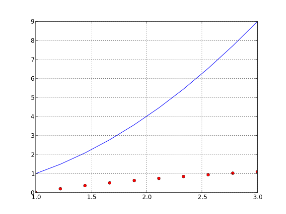

# Numerical Differentiation

**Matplotlib** is an open-source add-on module to Python for 2D plotting that generates production quality graphs in Matlab style.

The Matplotlib module must be imported first. For example, one can import the basic plotting facilities, stored in the subpackage pyplot, under an abbreviated name, say `plt`:

	>>> import matplotlib.pyplot as plt
	>>> import numpy as np
	>>> x = np.linspace(1,3,10)
	>>> y = x**2  # quadratic function values
	>>> z = np.log(x)   # linear function values

A plot of y vs. x can now be created as follows:

	>>> plt.plot(x, y)
	[<matplotlib.lines.Line2D object at 0x03D3F770>]

Only a plot object is created; it is not immediately displayed in a figure. The reason is that one can add more plots to a figure and change styles. For example, one can add a plot of the logarithmic values as red circles and make gridlines visible.

	>>> plt.plot(x, z, 'ro') # plot points are red circles 
	[<matplotlib.lines.Line2D object at 0x03D3FB70>]
	>>> plt.grid(True) # display grid

To display the figure in a separate window, enter the following command

    >>> plt.show()

The window contains interactive controls: for example, one can pan and zoom in or out, and save the figure. After closing the window, the figure object cannot be accessed anymore (unless it was assigned to a name). One can also immediately save the figure in a file, in various formats, by the savefig command:

	>>> plt.plot(x, y, 'r-') # points connected by red line segments
	>>> plt.savefig('C:/temp/fig1.jpg') # save figure in JPEG format

## Numerical Differentiation

In experimental work, one is often faced with the problem of finding the derivative of a function $$f(x)$$ whose form is only known as a tabulation of data. Suppose that one has a sequence of equally spaced points $$x_0, x_1, x_2, ..., x_n$$ with distance $$dx = x_1 - x_0$$, and function values $$y_0, y_1, y_2, ..., y_n$$  (i.e., $$y_i=f(x_i)$$ for all $$i$$). The numerical derivative $$f'(x)$$ of the function $$f(x)$$ can be approximated by a sequence $$y'_0, y'_1, y'_2, ..., y'_n$$ computed via the following central divided difference formula:

$$\displaystyle y'_k = \frac{y_{k+1} - y_{k-1}}{2dx}$$, for $$k=1,2,...,n-1$$.

It is based on averaging the following approximations of $$f(x)$$ for small values of $$h$$:

$$\displaystyle f'(x) \approx \frac{f(x+h)-f(x)}{h}$$ and $$\displaystyle f'(x) \approx \frac{f(x) - f(x-h)}{h}$$.

At the endpoints of the interval one can apply the following formulas:

$$\displaystyle y'_0 = \frac{-3y_0+4y_1-y_2}{2dx}$$ and $$\displaystyle y'_n = \frac{3y_n-4y_{n-1}+y_{n-2}}{2dx}$$.

### Assignment

Use the `NumPy` and `Matplotlib` modules to implement the above numerical differentiation in Python and to apply the algorithm for the sine function approximated by function values calculated for 25 equally spaced points in the interval $$[0,2\pi]$$ (Hint: use the NumPy function roll to rotate arrays). Draw data plots of $$y$$ and $$y'$$ in one figure. What do you think of the result? Does it improve when more data points are available, say 101 equally spaced points? Does your code still works fine when you use 1000001 equally spaced points in the interval $$[0,2\pi]$$?
